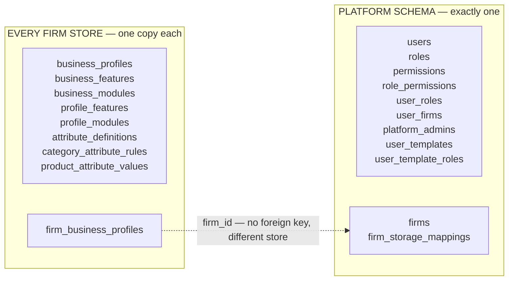
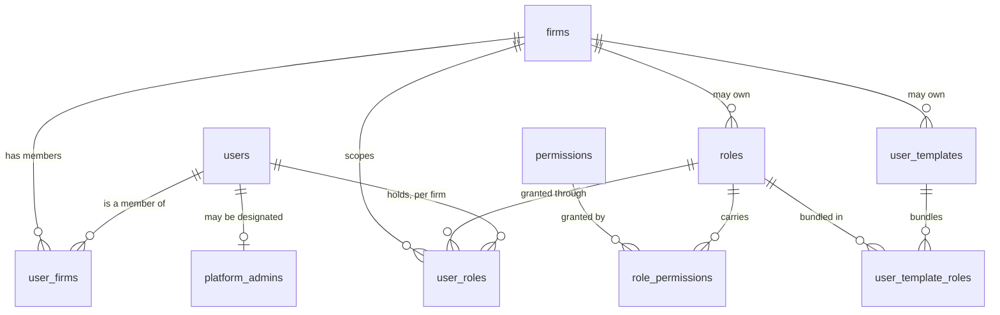
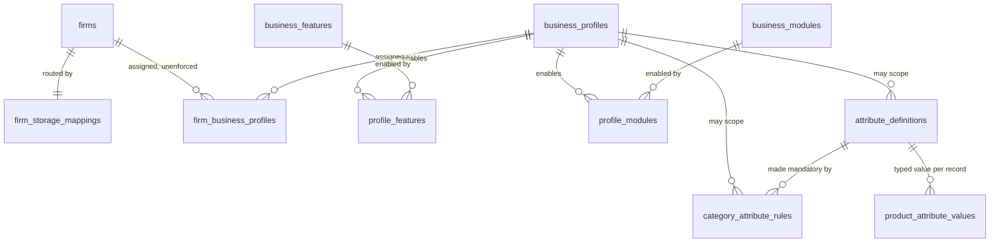

# Data model — identity, firms and profile settings

The schema view of two domains: users, roles and permissions on one side;
firms, business profiles and custom fields on the other. `docs/ACCESS_CONTROL_FRAMEWORK.md`
and `docs/BUSINESS_PROFILE_FRAMEWORK.md` describe how they *behave* — this
describes what the tables are, how they join, and where each one physically
lives, which is the part that decides what a query can do at all.

Columns, foreign keys and unique constraints below are read from the ORM
metadata; the store boundary and the absent `firm_id` foreign key were
verified against a running PostgreSQL database on 2026-09-07. Audit and
history tables are omitted.

## The boundary first

Read this before the entity diagrams. Every table exists in one of two places,
and which one decides what a query can join and what a foreign key can
enforce.

**The one arrow that crosses is unenforced.** `firm_business_profiles` lives in
the firm's own store and its `firm_id` names a row in `firms`, which exists
only in the platform schema — so PostgreSQL cannot check it. Confirmed by
querying `information_schema`: that table's only deployed foreign key is
`business_profile_id`, pointing at the copy of `business_profiles` in its own
store, and `firms` appears in the `platform` schema and nowhere else.

Two consequences follow, and both have caused defects:

- **A firm-owned service cannot resolve `users`, `firms` or `user_firms`.** A
  tenant session runs `SET search_path TO "<firm schema>"` with no fallback,
  so a `select(Firm)` there raises `UndefinedTable`. Use `platform_reader()`
  from `app/common/firm_metadata.py`, or `FirmMetadataReader` for the firm's
  own name, code, GST number and financial year.
- **A platform endpoint touching firm-owned data must name the store.** Use
  `firm_store_session(request, firm_id)`; routing on the caller's own
  `X-Firm-ID` writes into whichever firm the caller happens to be in. The
  business-profile assignment endpoints did exactly that and reported success
  while changing nothing in the firm named in the URL.

A request carries `X-Firm-ID`; `FirmRegistryTenantResolver` reads
`firm_storage_mappings` to decide which store to open.

## Users, roles and permissions

All nine tables live in the platform schema. The chain is three links — a
permission is a capability, a role names a set of permissions, a template
names a set of roles — and a firm administrator may write their own at the
role and the template level.

| Table | Key columns | What decides behaviour |
| --- | --- | --- |
| `users` | `email`, `password_hash`, `authorization_version` | `email` is unique **only among live accounts** (`UQ_users_email_active`), so soft-deleting a user releases the address — always filter `is_deleted` in an email lookup. Bumping `authorization_version` invalidates every issued token. |
| `roles` | `code`, `is_system`, `firm_id` | `firm_id` **NULL means platform-wide**; set means the firm wrote it. `code` matches `^[a-z0-9._-]+$`, and the reserved names are refused case-insensitively — a role called `platform_admin` was once a route to the designation. |
| `permissions` | `code`, `is_system` | 189 seeded codes, `DOMAIN_ACTION`. A code passed to `require_permission` and not seeded here has no row, so it can be attached to no role and the endpoint silently becomes platform-admin-only. |
| `role_permissions` | `role_id`, `permission_id` | Unique on the pair. |
| `user_roles` | `user_id`, `role_id`, `firm_id` | **This is where a role becomes firm-scoped.** The same person holds different roles in different firms; unique on all three columns. |
| `user_firms` | `user_id`, `firm_id`, `is_primary`, `is_active` | Membership, and the firm somebody lands in. `is_primary` is one flag across every firm a person belongs to, held by `UQ_user_firms_active_primary` — which is why a caller who can see only some memberships must not move it. |
| `platform_admins` | `user_id`, `scope` | The designation, which **no role can spell**. `scope` is `PLATFORM` (runs the platform, refused a firm's books) or `ALL_FIRMS`. No server default and the ORM default is the narrow one, so state it explicitly when creating a row. |
| `user_templates` | `code`, `firm_id`, `is_system` | A named bundle of roles. `firm_id` NULL means offered to every firm, which needs **two partial indexes** rather than one: PostgreSQL treats NULLs as distinct, so a single key on `(firm_id, code)` would let the platform hold ten templates called `counter-sales`. |
| `user_template_roles` | `template_id`, `role_id` | Unique on the pair. Validated at creation, not only at apply, so a template naming an unassignable role fails then rather than for whoever tries to use it weeks later. |

### Three `firm_id` columns, three different questions

They are easy to conflate and they answer different things. All three live in
the platform schema.

| Column | Question it answers | NULL means |
| --- | --- | --- |
| `user_firms.firm_id` | **Which firms is this person a member of?** | not nullable — a membership always names a firm |
| `user_roles.firm_id` | **Where does this person hold this role?** | the **global** tier: every firm they belong to, now and in future. Only a platform administrator writes it; a firm administrator sees it and cannot change it. |
| `roles.firm_id` | **Who wrote this role definition?** | a platform-wide role, offered to every firm |

`user_firms` says somebody *belongs*; `user_roles` says what they may *do*
there. A member with no roles sees an empty application, and — because of the
NULL case on `user_roles` — somebody can hold a role in a firm they were only
just added to.

Each tier is replaced only by a save of its own tier -- `_replace_global_user_roles`
for the NULL rows, `_replace_scoped_user_roles` for one firm's -- so a platform
administrator's save cannot delete a firm's grants and a firm administrator's
cannot delete a global one. Before that split, the platform path keyed on
`role_id` alone and a no-op save collapsed every firm's roles into global ones.

The distinction that catches people is between the last two. `SALES_MANAGER`
has `roles.firm_id = NULL`, meaning any firm may use it; a *grant* of it has
its own `user_roles.firm_id`, which decides where that person is a sales
manager. The first is about the definition, the second about the grant, and
only the second varies per person. See "Assigning roles" in
`docs/ACCESS_CONTROL_FRAMEWORK.md` for which caller writes which.

As seeded here, all 16 roles carry `roles.firm_id = NULL` and `is_system =
true`; a firm writing its own role through Administration → Roles & Permissions
→ Roles produces the
first non-NULL row.

## Firms, profiles and settings

Two tables in the platform schema decide that a firm exists and where its rows
live. Everything that configures it lives inside the firm's own store —
including the catalogue it is configured *from*.

| Table | Store | What decides behaviour |
| --- | --- | --- |
| `firms` | platform | `code`, `gst_number` and `pan_number` are unique **among live firms only** (`UQ_firms_<column>_active`), so a deleted firm releases them. `financial_year_start` is what the accounting calendar and the TCS threshold read. |
| `firm_storage_mappings` | platform | One row per firm. `deployment_mode` is `SHARED` / `SCHEMA` / `DATABASE` and is **fixed at creation** — nothing migrates rows between stores, so `FirmService.update` refuses to change it. A `SHARED` firm carries NULL `database_name` and `schema_name` and resolves to the configured shared store; reading the NULLs directly resolves to no schema at all. `provisioned_at` NULL on a dedicated firm means it cannot serve requests yet, and `provisioning_error` keeps the reason on the record. |
| `business_profiles` | firm store | The catalogue — 12 seeded industries, **copied into every store**, so the same profile id exists everywhere. `is_default` marks the one an unassigned firm falls back to. |
| `firm_business_profiles` | firm store | The assignment. Written by a platform administrator through `firm_store_session(request, firm_id)`, and the row the boundary section is about. |
| `profile_features` / `profile_modules` | firm store | What each profile switches on. **A missing row is not "disabled"** — it falls back to the catalogue's `default_enabled`, and the two code paths disagreeing about that was a real defect. `profile_modules.is_visible` hides a menu entry and deliberately does not gate the write. |
| `business_features` / `business_modules` | firm store | The catalogue of what can be switched on. `is_implemented` on a feature is a fact about the codebase, deliberately not an administrator's choice, and the service refuses to enable a feature that is false. |
| `attribute_definitions` | firm store | Custom fields. `applicable_business_profile_id` and `applicable_category` are **NULL for "every"**, not "none". `mandatory` here applies to every category the definition reaches. **No `firm_id`**, so firms sharing a store share these rows. |
| `category_attribute_rules` | firm store | Mandatory for one `category_code`, optionally scoped to one profile. A rule naming a definition this firm's profile does not get is inert rather than an error, because `mandatory_ids` intersects the rules against `definitions_for`. |
| `product_attribute_values` | firm store | The values, in typed columns (`value_text` / `value_number` / `value_date` / `value_boolean`) so list filters can index them. One such table per module; never JSON. |

## What the schema cannot tell you

Five rules that live in services and partial indexes rather than in column
types. Each is the residue of a defect.

- **NULL means "all".** On `roles.firm_id`, `user_templates.firm_id`,
  `applicable_business_profile_id` and `applicable_category`. Reading it as
  "none" inverts the meaning — `20260801_0011` set four attributes mandatory
  with no scope, which asked a pharmacy for an IMEI and blocked product
  creation on every freshly migrated database until `20260815_0087`.
- **Unique means unique-if-live.** Users' email and firms' code, GST and PAN
  are partial indexes over `is_deleted = false`. Any lookup that forgets
  `is_deleted` finds a ghost.
- **`ondelete="RESTRICT"` is not a guard.** Everything here soft-deletes, and a
  soft delete never reaches the database's referential check — a "deleted" row
  stays wired to everything naming it and simply vanishes from lists. The
  refusal has to live in the service.
- **`version` is the concurrency counter.** Every entity carries it, every ORM
  update bumps and checks it, and a stale write raises `StaleDataError`
  (mapped to 409). No model may declare its own `version` column for a
  business meaning; `tax` and `uom` both had to rename theirs to
  `version_number`.
- **The catalogue is per store.** Profiles, features, modules and attribute
  definitions are copied into every firm store rather than held centrally, so
  a query against one store answers about the firms in that store only — and
  two firms sharing a store share the rows. Editing a definition in a `SHARED`
  firm edits its neighbour's; `docs/BACKLOG.md` §16 is the proposal to give
  those two tables a `firm_id`.
