# The firm's domain model

What a firm is made of, which entity owns which decision, how each one is
created, and how they hang together. Purely the firm's own world: its
profile, its configuration, its masters and its territory. People and
permissions are in [`DATA_MODEL_IDENTITY_AND_FIRMS.md`](DATA_MODEL_IDENTITY_AND_FIRMS.md)
and [`ACCESS_CONTROL_FRAMEWORK.md`](ACCESS_CONTROL_FRAMEWORK.md); documents
and money are in [`SALES_FRAMEWORK.md`](SALES_FRAMEWORK.md) and
[`PURCHASE_FRAMEWORK.md`](PURCHASE_FRAMEWORK.md).

Written 2026-09-08 and derived from the ORM rather than remembered: the
three tiers below are what `Base.metadata` says, table by table.

---

## 1. Three tiers, and why it matters which one an entity is in

Every table lives in exactly one of three places, and the place decides who
can share it.

| Tier | Where the rows live | Shared by | Examples |
| --- | --- | --- | --- |
| **Platform** | The `platform` schema, one per installation | Every firm | `firms`, `firm_storage_mappings`, `users`, `user_firms`, `roles`, `permissions` |
| **Store** | The firm's store, **without** a `firm_id` column | Every firm in that store | `business_profiles`, `business_features`, `business_modules`, `attribute_definitions`, `category_attribute_rules`, `uoms`, `uom_groups`, `packaging_types`, `uom_industry_templates`, the six `geo_*` masters, `sales_hierarchy_levels` |
| **Firm** | The firm's store, **with** a `firm_id` column | That firm alone | `branches`, `warehouses`, `products`, `customers`, `vendors`, `sales_territories`, the whole `tax_*` set, price lists, promotions, every `*_settings` table, every `*_attribute_values` table |

A **store** is a SHARED schema (`firm_shared`, shared by MEDI01 and FOOD01
in the demo), a dedicated schema, or a dedicated database. So a store-tier
master is *private to a dedicated firm* and *shared between SHARED-mode
firms*. That is the single most important fact in this document: a
pharmacy and a food distributor in the shared store edit **one** attribute
catalogue, **one** unit catalogue and **one** country list. A firm in its own
schema has its own copy of all three.

Child rows carry no `firm_id` when their parent does -- `customer_addresses`,
`vendor_contacts`, `warehouse_storage_nodes`, `territory_customer_assignments`
-- and are firm-owned through the parent.

---

## 2. The map

```mermaid
erDiagram
    FIRM ||--o| STORAGE_MAPPING : "routed by"
    FIRM ||--o| BUSINESS_PROFILE_ASSIGNMENT : "operates as"
    BUSINESS_PROFILE ||--o{ BUSINESS_PROFILE_ASSIGNMENT : ""
    BUSINESS_PROFILE ||--o{ PROFILE_FEATURE : enables
    BUSINESS_PROFILE ||--o{ PROFILE_MODULE : offers
    BUSINESS_PROFILE ||--o{ ATTRIBUTE_DEFINITION : "scopes (optional)"
    BUSINESS_PROFILE ||--o{ CATEGORY_ATTRIBUTE_RULE : "makes mandatory"
    BUSINESS_PROFILE ||--o{ PROFILE_UOM_DEFAULT : "prefills"

    FIRM ||--o{ BRANCH : has
    BRANCH ||--o{ WAREHOUSE : has
    WAREHOUSE ||--o{ STORAGE_NODE : "zones, racks, bins"

    FIRM ||--o{ PRODUCT_CATEGORY : has
    FIRM ||--o{ PRODUCT : has
    PRODUCT_CATEGORY ||--o{ PRODUCT : classifies
    UOM ||--o{ PRODUCT : "seven unit slots"
    PRODUCT ||--o{ UOM_CONVERSION_RULE : "own factor"
    PRODUCT ||--o{ PACKAGING_LEVEL : "case, carton"
    PACKAGING_TYPE ||--o{ PACKAGING_LEVEL : ""
    TAX_PROFILE }o--o{ PRODUCT : "by group code"

    FIRM ||--o{ TAX_SYSTEM : has
    TAX_SYSTEM ||--o{ TAX_COMPONENT : ""
    TAX_SYSTEM ||--o{ TAX_PROFILE : ""
    FIRM ||--o{ TAX_RULE : has

    FIRM ||--o{ CUSTOMER_GROUP : has
    FIRM ||--o{ CUSTOMER : has
    CUSTOMER_GROUP ||--o{ CUSTOMER : segments
    CUSTOMER ||--o{ CUSTOMER_ADDRESS : ""
    CUSTOMER ||--o{ CUSTOMER_CONTACT : ""
    GEO_MASTER ||--o{ CUSTOMER_ADDRESS : "six keys"
    FIRM ||--o{ PRICE_LIST : has
    CUSTOMER ||--o{ PRICE_LIST : "own arrangement"

    FIRM ||--o{ VENDOR_CATEGORY : has
    FIRM ||--o{ VENDOR_TYPE : has
    FIRM ||--o{ VENDOR : has
    VENDOR ||--o{ VENDOR_ADDRESS : ""
    VENDOR ||--o{ VENDOR_CONTACT : ""
    VENDOR ||--o{ VENDOR_BANK_ACCOUNT : ""

    FIRM ||--o{ TERRITORY_NODE : "a tree"
    HIERARCHY_LEVEL ||--o{ TERRITORY_NODE : "names the rung"
    TERRITORY_NODE ||--o| ROUTE_PROFILE : "what makes it a route"
    TERRITORY_NODE ||--o{ WORKING_DAY : ""
    TERRITORY_NODE ||--o{ TERRITORY_CUSTOMER : "shops on the round"
    CUSTOMER ||--o{ TERRITORY_CUSTOMER : ""
    TERRITORY_NODE ||--o{ TERRITORY_SALESMAN : "who covers it"
    USER ||--o{ TERRITORY_SALESMAN : ""
    TERRITORY_NODE ||--o{ BEAT_PLAN : "a recurrence"
    PRICE_LIST }o--o| TERRITORY_NODE : "optional scope"

    ATTRIBUTE_DEFINITION ||--o{ ATTRIBUTE_VALUE : "typed value"
    PRODUCT ||--o{ ATTRIBUTE_VALUE : ""
    CUSTOMER ||--o{ ATTRIBUTE_VALUE : ""
    VENDOR ||--o{ ATTRIBUTE_VALUE : ""
    BRANCH ||--o{ ATTRIBUTE_VALUE : ""
    WAREHOUSE ||--o{ ATTRIBUTE_VALUE : ""
```

Store-tier entities in the diagram: `BUSINESS_PROFILE` and its features,
modules and defaults, `ATTRIBUTE_DEFINITION`, `CATEGORY_ATTRIBUTE_RULE`,
`UOM`, `PACKAGING_TYPE`, `GEO_MASTER`, `HIERARCHY_LEVEL`. Platform-tier:
`FIRM`, `STORAGE_MAPPING`, `USER`. Everything else is the firm's own.

---

## 3. The firm itself

**Responsibility.** The trading entity: its legal identity (name, GST, PAN,
address), its money (`currency_code`), its calendar
(`financial_year_start`), and **where its data lives**. Nothing else in the
platform works until it exists, because every firm-owned screen is
authorised twice -- what the user may do, and which firm they may do it to.

**Created by** a platform administrator on **Administration › Firms**
(`POST /api/v1/firms`). Creation records the intent only. A dedicated firm's
storage is built by **Provision storage**, and the rest of its setup by the
**Set up** panel on the same grid: open the books, apply the GST template,
assign the profile, create the first branch and warehouse. See the runbook
in [`FUNCTIONAL_GUIDE.md`](FUNCTIONAL_GUIDE.md#runbook--a-new-firm-from-nothing-to-trading).

**Relationships.**

| Link | Table | Rule |
| --- | --- | --- |
| Storage routing | `firm_storage_mappings` | SHARED, SCHEMA or DATABASE plus an optional connection profile naming another server. **Fixed at creation**; nothing migrates rows between stores. |
| People | `user_firms` | Membership, one primary per person. Platform-tier, so a firm-owned service never reads it on its own session. |
| Business profile | `firm_business_profiles` (firm's store) | At most one live assignment; none means the store's default, usually GENERIC. |
| Everything below | `firm_id` on every firm-tier table | The firm is the root of the aggregate; deleting a firm is refused while anyone belongs to it. |

**Settings that are the firm's own**, each a one-row table keyed on
`firm_id` with a defaulted fallback when the row is absent:

| Setting | Table | Decides | Screen |
| --- | --- | --- | --- |
| Which sales stages are typed | `sales_workflow_settings` | Whether a quotation, an order and a delivery note are raised by a person or synthesised by the service when the invoice is approved | Sales Invoices › Sales stages |
| Credit policy | `credit_control_settings` | OFF / WARN / BLOCK, the warn and block percentages, judged at order and invoice approval | Customers › Settings |
| Tax labels and behaviour | `tax_settings` | What the firm calls its tax, whether historical profiles may mix | Configuration › Tax Configuration › Settings |
| Tax collected at source | `tcs_settings` | Whether 206C(1H) is collected, the thresholds, the stated turnover | Sales › TCS |
| Loyalty | `loyalty_settings` | Earn rate, redemption value, expiry | Masters › Loyalty |
| Control accounts | `firm_control_accounts` | Which ledger account each of the 24 posting purposes lands in | Finance › Control Accounts |
| Document numbering | `document_type_definitions`, `document_numbering_rules`, `document_state_definitions` | Series, prefix, reset, and the lifecycle states each document kind moves through; created lazily on the first save | Administration › Numbering Series |

---

## 4. Business profile: what kind of firm this is

**Responsibility.** An *industry* as a bundle of decisions: which
**features** are switched on (batch tracking, expiry, serial numbers,
warranty, barcodes, attachments, vehicle tracking…), which **modules** the
desktop offers (kitchen, recipes, projects, contracts beside the common
ten), which **custom fields** apply, and which **unit defaults** a new
product starts with. The catalogue is store-tier: twelve profiles ship with
every store, and a platform administrator may add one.

**Created by** a platform administrator on **Configuration › Business
Profiles**. **Assigned** to a firm on the same group's **Profile
Assignment** tab or from the Firms **Set up** panel -- the assignment row
lives in the firm's own store, which is why the platform screen opens that
store by name rather than the caller's.

**Where it is useful, and where it is not.**

| It decides | How | Enforced? |
| --- | --- | --- |
| Whether a write may populate a feature's fields | `assert_feature_fields` in the owning service; `require_feature` on the few endpoints that own a resource outright | Yes, for 11 of 22 declared features; reads always pass |
| Which custom fields a form offers and a save accepts | `attribute_definitions.applicable_business_profile_id`: null means every profile, a value means that one | Yes, on every save |
| Which fields are mandatory per product category | `category_attribute_rules` scoped to profile and category | Yes, on product save |
| Which units a new product starts with | `business_profile_uom_defaults`, profile-wide or per firm | Prefilled on the form, not enforced |
| Which tax profiles and rules apply | `tax_profiles.business_profile_id`, `tax_rules.business_profile_id`, optional scoping | Yes, in rule matching |
| Which modules the desktop shows | `profile_modules`, read through `/active-modules` | **No** -- cosmetic; the server does not gate a module |

Six declared features carry `is_implemented = false` and cannot be switched
on. `TERRITORY`, `APPROVAL_WORKFLOW` and `MULTIPLE_WAREHOUSES` work for every
firm and are deliberately ungated pending a product decision.
[`BUSINESS_PROFILE_FRAMEWORK.md`](BUSINESS_PROFILE_FRAMEWORK.md) is the
reference.

---

## 5. Attributes: fields a firm adds without code

**Responsibility.** Industry-specific fields on a record -- a drug licence
on a customer, a warranty period on a product, a dock-bay count on a
warehouse -- declared by an administrator and stored in typed columns so a
report can filter on them. Never a JSON blob.

**Three tables, three tiers of meaning.**

| Table | Tier | Holds |
| --- | --- | --- |
| `attribute_definitions` | Store | The field: code, name, `entity_type` (PRODUCT, CUSTOMER, VENDOR, BRANCH, WAREHOUSE, TAX_PROFILE, UOM), `data_type` (TEXT, NUMBER, DATE, BOOLEAN), `mandatory`, optional profile scope, optional category scope, and `validation_rule.allowed_values` for a fixed-choice TEXT field |
| `category_attribute_rules` | Store, scoped by profile | "This field is mandatory for products in this category under this profile" -- the only right way to make a field required, because `mandatory` on the definition itself applies everywhere it is offered |
| `<entity>_attribute_values` | Firm, one table per entity type | One row per record per definition, the value in `value_text` / `value_number` / `value_date` / `value_boolean`, a real foreign key to the owner |

**Created by** a platform administrator on **Configuration › Business
Profiles › Dynamic Attributes** and **Mandatory Attributes**. **Filled in**
by whoever edits the record: every one of the seven entity types takes
`attributes` on its write schema and returns them on its response; products,
customers, vendors, branches and warehouses show them on the form, units and
tax profiles only through the API so far.

**Two rules that bite.** In a SHARED store the catalogue is one for every
firm in it, so a field added for the pharmacy is visible to the food
distributor unless it is scoped to the PHARMACY profile. And changing a
firm's profile stops the scoped fields being *read* without touching the
values -- switch back and they reappear.

---

## 6. Units and packaging

| Entity | Tier | Responsibility | Created |
| --- | --- | --- | --- |
| `uoms` | Store | The catalogue: PIECE, KG, LITRE, BOX, CASE… seeded by the migration (the shared store holds 19); whole-number units cannot hold a fraction | Configuration › UOM & Packaging › Units of Measure |
| `uom_groups`, `uom_group_units` | Store | Families of units that convert among themselves | Configuration › UOM & Packaging › UOM Groups |
| `packaging_types` | Store | BOX, CARTON, CASE, PALLET and the rest -- what a packaging level *is*; thirteen are seeded | Configuration › UOM & Packaging › Packaging Types |
| `business_profile_uom_defaults` | Store, optionally per firm | The seven unit slots a new product starts with for an industry | Configuration › UOM & Packaging › Industry Templates |
| `uom_conversion_rules` | **Firm** | Effective-dated factor between two units, firm-wide or for one product; the product's own rule outranks the firm's | Configuration › UOM & Packaging › Conversion Rules |
| `product_packaging_levels` | Firm, per product | Case, carton, pallet: a named level with its factor to base units and a barcode | Configuration › UOM & Packaging › Packaging Levels |

A product carries **seven unit slots** (base, inventory, purchase, sales,
default receiving, default dispatch, minimum sales) and every document
module converts a line through `convert_quantity` on the way to stock.
[`UOM_FRAMEWORK.md`](UOM_FRAMEWORK.md) is the reference.

---

## 7. Tax

Every tax table is **firm-tier**, so a new firm has none until the GST
template is applied (Firms › Set up › Apply GST template) or the framework is
built by hand under **Configuration › Tax Configuration**.

| Entity | Responsibility |
| --- | --- |
| `tax_systems` | One regime, tied to a country: GST |
| `tax_components` | The legs: CGST, SGST, IGST, CESS |
| `tax_profiles` + `tax_profile_components` | A rate card a product points at by **group code** (`GST_18_LOCAL`); effective-dated, versioned, optionally scoped to a business profile |
| `tax_rules` + conditions + actions | Transaction-level decisions in priority order, first match wins: switch a local slab to its interstate twin, zero-rate an export, allow input credit on a purchase |
| `tax_country_mappings` | Which system a country defaults to |
| `tax_settings` | The firm's labels and whether historical profiles may mix |

Rules attach to the **transaction**, never to a product; the product
contributes its group code, category and type to the match.
[`TAX_FRAMEWORK.md`](TAX_FRAMEWORK.md) is the reference.

---

## 8. Branches and warehouses

| Entity | Responsibility | Created |
| --- | --- | --- |
| `branches` | A place the firm trades from: address through the six geography keys, its own GST registration, one default per firm | Masters › Branches, or Firms › Set up › Create head office and main warehouse |
| `branch_types` | The firm's own classification of branches; optional | Masters › Branch Types |
| `warehouses` | Where stock is: **always under a branch**, ten capability flags (cold storage, receiving area…), one default per branch | Masters › Warehouses |
| `warehouse_types` | Optional classification | Masters › Warehouse Types |
| `warehouse_storage_nodes` | Zones, racks, bins inside a warehouse, a tree | Masters › Storage Areas |

Stock cannot move until a warehouse exists, which is why the setup panel
treats branch and warehouse as one step. Deleting either is refused while
stock or documents reference it -- in the service, because `ondelete=RESTRICT`
never fires on a soft delete.

---

## 9. Products

**Responsibility.** What the firm buys and sells: identity (code, name, HSN),
classification (`product_categories`, a tree, firm-tier), the seven unit
slots, prices (purchase, selling, MRP), the tax group code, the tracking
flags (`track_batch`, `track_serial`, `track_expiry`, and whether a receipt
or issue *requires* the batch or serial), custom attributes, packaging
levels, media.

**Created** on **Masters › Products**, whose form reads the firm's profile
for unit defaults and applicable attributes. The profile's feature switches
decide whether the batch, serial, expiry, warranty and barcode fields may
be populated at all.

---

## 10. Customers

**Responsibility.** Who the firm sells to, and on what terms. The legal
classification (`customer_type`: INDIVIDUAL or BUSINESS), the commercial
segment (`customer_group_id`), the standing discount, the credit limit and
payment terms, the running balances (`current_outstanding`,
`unapplied_advance_balance`, derived from the receivable ledger), addresses
through the geography keys, contacts, custom attributes.

| Related entity | Tier | Relationship |
| --- | --- | --- |
| `customer_groups` | Firm | A flat segmentation: Retailer, Wholesaler, Institution. Carries the segment's discount, the **last** tier of price resolution. Deleting a group somebody is in is refused |
| `price_lists` + `price_list_items` | Firm | A ladder of rates by quantity break, firm-wide, per territory, or **per customer** -- a customer's own list replaces the firm's rather than merging into it |
| `customer_addresses` | Via parent | Billing and shipping, with the six `geo_*` keys as the truth and the text derived from them |
| `credit_control_settings` | Firm | The policy the customer's `credit_limit` is judged against |
| `loyalty_entries` | Firm | Points earned and spent, one ledger; the balance is a sum, never a column |
| `territory_customer_assignments` | Via territory | Which rounds call on the shop, which one is primary, and the visit sequence |

**Created** on **Masters › Customers**. Price precedence for a line, from
[`SALES_TO_RECEIPT_FLOW.md`](SALES_TO_RECEIPT_FLOW.md): an explicit amount,
an explicit percentage, a promotion, the price list, the customer's standing
rate, then the group's.

---

## 11. Vendors

**Responsibility.** Who the firm buys from: identity, GST registration and
licence, the firm's own classification (`vendor_categories`, `vendor_types`),
and the child collections -- contacts, addresses, bank accounts, tax details,
attachments, notes -- plus custom attributes.

**Created** on **Masters › Vendors**. The write model's collections are
`None` for "leave alone" and `[]` for "clear", because an update replaces
rather than merges and a form that does not manage a collection must not be
able to erase it by omission. The legacy `business_attributes` JSON column
is deliberately not the custom-field mechanism.

---

## 12. Territory: where the firm sells, and who goes there

**Responsibility.** The firm's map of its market as a tree, and the rounds a
salesperson walks. [`TERRITORY_FRAMEWORK.md`](TERRITORY_FRAMEWORK.md) is the
reference.

| Entity | Tier | Responsibility |
| --- | --- | --- |
| `sales_hierarchy_levels` | **Store** | The rungs of the tree by name -- Region, Area, Route -- shared by every firm in a SHARED store |
| `sales_territories` | Firm | The nodes: a tree through `parent_id`, each on one rung |
| `territory_route_profiles` | Via node | **What makes a node a route**: an effective window, a route type, a schedule. A node without one is a grouping, not something anyone walks |
| `territory_working_days` | Via node | Which weekdays the round works; a beat plan on another day calls nobody |
| `sales_route_types` | Firm | Van, bike, on foot -- the firm's own vocabulary |
| `territory_customer_assignments` | Via node | The shops on the round, `is_primary` (one per shop), `visit_sequence` (the stop order, unique per round) |
| `territory_salesman_assignments` | Via node | Who covers the round, by `user_id`. The user is **platform-tier**, so a name is resolved on the platform session and matched by id here |
| `sales_beat_plans` + stops | Firm | A recurrence -- weekly, fortnightly, monthly -- on a route; a **call list** is derived for a day from the recurrence, the route's effective window and its working days, all three at once |
| `price_lists.territory_id` | Firm | A price list may be scoped to a territory |
| `commission_rules` | Firm | Who earns what, by person, product or category -- a salesperson is a user again |

**Created** on **Sales › Geography** (route types and beat plans are the tabs beside it): the hierarchy first,
then nodes, then a route profile on the nodes that are rounds, then
customers and salespeople assigned to them, then beat plans. A document
raised for a customer derives its salesperson from the primary round; naming
somebody else who does not cover the customer's round is refused.

**The customer's three keys.** A shop on a round carries the round, whether
it is the primary one, and its stop number. `PUT /{id}/customers` replaces
the whole list with the order implied by position, and omitting `is_primary`
means leave it alone.

---

## 13. How a firm comes to exist, in order

Each step depends on the one before it. The **Set up** panel on
Administration › Firms shows them as done or missing.

1. **Firm record** -- platform administrator. Nothing is built.
2. **Storage** -- provisioned for a dedicated firm; a SHARED firm is ready at once. Provisioning runs the migrations, which is how the store gets its units, profiles, features, packaging types and industry templates.
3. **Books** -- default chart, the current financial year with twelve periods, journal and voucher types, all 24 control accounts.
4. **Tax** -- the GST template, or the framework by hand.
5. **Business profile** -- assigned from the panel or Profile Assignment. Until then the firm trades as GENERIC.
6. **Branch and warehouse** -- a default pair from the panel, or named by hand.
7. **People** -- memberships and roles; see the identity documents.
8. **Masters** -- products, customers, vendors, then territories and price lists if the firm uses them. Numbering needs nothing.

---

## 14. Traps worth knowing before touching any of it

- **A store-tier master is shared in SHARED mode.** Attribute definitions, units, packaging types, hierarchy levels and geography are one set for MEDI01 and FOOD01. Scope a definition to a profile if only one industry should see it.
- **A platform screen touching firm data must open that firm's store by name** (`firm_store_session`), or it writes into whichever firm the administrator happened to have selected and reports success.
- **`firms`, `users` and `user_firms` exist only in the platform schema.** A firm-owned service reads them through `FirmMetadataReader` or a platform session, never on its own.
- **`ondelete=RESTRICT` is not a guard.** Deletes are soft, so the refusal has to live in the service and look at everything that references the row.
- **An update that dumps its whole write model turns an omission into an instruction.** Partial updates read `model_fields_set`; child collections use `None` for "leave alone".
- **A master field added later never reaches a store already seeded.** The demo seeder skips existing masters, so every new field needs a backfill written beside it.
- **The geography keys are the truth and the address text is derived.** A city id and a city name that disagree leave nothing to say which a report should believe.
